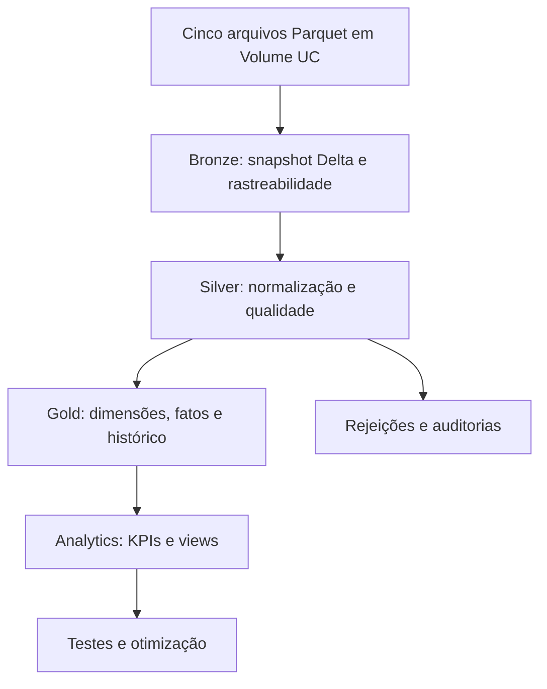

# Nordeste Health Lakehouse

**Projeto pessoal de [Rower Bomfim](https://www.linkedin.com/in/rower-bomfim/) — saúde e engenharia de dados.**

Pipeline batch em Databricks que integra cinco bases cadastrais de saúde do Nordeste brasileiro. O projeto usa Unity Catalog, Volumes, Delta Lake, PySpark e Spark SQL para construir as camadas Bronze, Silver e Gold, um modelo dimensional e indicadores de capacidade hospitalar, infraestrutura e força de trabalho.

**Recorte configurado:** competência `202607`; UFs `AL`, `BA`, `CE`, `MA`, `PB`, `PE`, `PI`, `RN` e `SE`. O escopo de rede é o representado nos cinco arquivos, sem filtro exclusivo para estabelecimentos SUS.

> Os indicadores descrevem o cadastro recebido. Quantidades, horas e classificações exigem interpretação conforme o contrato de medidas. O cadastro não comprova disponibilidade por turno, dedicação exclusiva à UTI, titulação profissional, desfechos clínicos ou conformidade assistencial.

## Motivação e entregas

Este projeto une minha formação em Fisioterapia e experiência em UTI aos estudos em Análise e Desenvolvimento de Sistemas e engenharia de dados. Escolhi o domínio da saúde para exercitar integração de fontes, rastreabilidade, modelagem dimensional, testes de qualidade e interpretação responsável das medidas.

Os cadastros de estabelecimentos, habilitações, leitos, profissionais e equipamentos têm granularidades diferentes. O pipeline os relaciona sem multiplicar quantidades ou vínculos por joins e entrega três perspectivas:

| Indicador | Pergunta analítica | Grão da saída |
| --- | --- | --- |
| Suporte intensivo | Qual a proporção entre horas hospitalares semanais cadastradas de intensivistas/enfermeiros e leitos UTI selecionados? | CNES + competência |
| Densidade tecnológica | Como o inventário cadastrado se compara a um cenário explícito por habilitação UTI e equipamento? | CNES + competência + habilitação + equipamento |
| Concentração de ocupações médicas | Como ocupações médicas diferenciadas e suas horas se distribuem entre municípios? | UF + município + competência |

A implementação produz cinco tabelas Bronze, cinco tabelas Silver, tabelas de rejeições e auditorias, quatro dimensões, duas fatos, uma ponte de habilitações, referências versionadas, snapshots históricos do modelo Gold e quatro views de consumo.

## Arquitetura e stack



| Componente | Aplicação no projeto |
| --- | --- |
| Databricks | Execução dos notebooks e job de quatro tarefas |
| Apache Spark / PySpark | Transformações distribuídas, validações e agregações |
| Spark SQL | DDL, views e implementação independente do KPI 1 |
| Delta Lake | Tabelas, histórico, `replaceWhere`, `OPTIMIZE` e `ZORDER` |
| Unity Catalog / Volumes | Governança de catálogo, schemas, arquivos, tabelas e views |
| Declarative Automation Bundles | Definição versionada do job, dependências e computação configurável |
| GitHub | Revisão do código e rastreabilidade das mudanças |

| Camada | Local | Responsabilidade |
| --- | --- | --- |
| Landing | `/Volumes/nordeste-health-lakehouse/landing/files` | Receber cinco snapshots Parquet |
| Bronze | `nordeste-health-lakehouse.bronze` | Preservar schema/conteúdo e adicionar metadados de carga |
| Silver | `nordeste-health-lakehouse.silver` | Normalizar, recortar, validar e auditar |
| Gold | `nordeste-health-lakehouse.gold` | Modelar, reconciliar, preservar histórico e publicar indicadores |

## Estrutura do repositório

```text
.
├── databricks.yml                         # Bundle e variável do cluster
├── resources/
│   └── nordeste_health_pipeline.job.yml   # Job Bronze → Silver → Gold → Analytics
├── src/
│   ├── notebooks/
│   │   ├── 01_bronze_ingestion.py
│   │   ├── 02_silver_transformation.py
│   │   ├── 03_gold_model.py
│   │   └── 04_analytics_validation.py
│   └── setup/
│       └── 00_bootstrap.sql               # Catálogo, schemas e Volume
├── .gitignore
└── README.md
```

| Ordem | Notebook | Função |
| --- | --- | --- |
| 1 | [`01_bronze_ingestion.py`](src/notebooks/01_bronze_ingestion.py) | Infraestrutura, ingestão, rastreabilidade e reprocessamento |
| 2 | [`02_silver_transformation.py`](src/notebooks/02_silver_transformation.py) | Competência, medidas, qualidade, órfãos e contrato |
| 3 | [`03_gold_model.py`](src/notebooks/03_gold_model.py) | Referências, dimensões, fatos, PK/FK, reconciliação e histórico |
| 4 | [`04_analytics_validation.py`](src/notebooks/04_analytics_validation.py) | KPIs, equivalência SQL/PySpark, views, otimização e grants opcionais |

Os notebooks foram extraídos do DBC para o formato Databricks SOURCE (`# Databricks notebook source`, `# COMMAND ----------` e `# MAGIC`). A conversão preserva código e Markdown, sem publicar resultados de células nem metadados internos do DBC. Uma célula Analytics exatamente duplicada foi removida. A ordem da evidência temporal Silver e a criação da view Gold foram ajustadas para a execução sequencial do código publicado.

## Fontes, medidas e competência

Os cinco arquivos devem ter os nomes abaixo no Volume. A Silver usa `MAPEAMENTO` para associar campos reais a nomes semânticos; alterações de schema exigem revisão desse contrato.

| Arquivo | Campos usados pelo pipeline |
| --- | --- |
| `estabelecimentos_de_saude.parquet` | `CO_CNES`, `CO_UF`, `CO_IBGE`, `NO_FANTASIA`, `CO_UNIDADE` |
| `habilitacoes.parquet` | `CNES`, `SGRUPHAB`, `COMPETEN` |
| `leitos.parquet` | `CNES`, `CODLEITO`, `QT_EXIST`, `COMPETEN`, `TP_LEITO` |
| `profissionais.parquet` | `CNES`, `CNS_PROF`, `CBO`, `VINCULAC`, `COMPETEN`, `HORAHOSP`, `HORA_AMB`, `HORAOUTR`, `PROF_SUS` |
| `equipamentos.parquet` | `CNES`, `CODEQUIP`, `QT_USO`, `COMPETEN`, `TIPEQUIP` |

| Campo da fonte | Medida adotada | Interpretação |
| --- | --- | --- |
| `QT_EXIST` | Leitos | Quantidade de leitos existentes cadastrados |
| `QT_USO` | Equipamentos | Quantidade de equipamentos em uso cadastrados |
| `HORAHOSP` | Horas semanais | Carga hospitalar cadastrada por vínculo profissional |
| `HORA_AMB`, `HORAOUTR` | Componentes separados | Não entram em `horas_semanais` hospitalares |

A base de estabelecimentos não traz `COMPETEN`: recebe a competência declarada `202607`. Antes de executar a Silver, preencha `EVIDENCIA_TEMPORAL` com um registro verificável da extração do snapshot e marque `conferida=True` apenas depois de confirmar a compatibilidade temporal dos cinco arquivos. O valor publicado inicia como `False`; uma página institucional genérica do CNES identifica a fonte, mas não prova a competência do arquivo específico.

## Como configurar e executar

### Pré-requisitos

- Workspace Databricks com Unity Catalog e computação compatível com Volumes, Delta Lake e os comandos de otimização usados pelos notebooks.
- Permissões para criar ou usar o catálogo `nordeste-health-lakehouse`, os schemas `landing`, `bronze`, `silver`, `gold`, o Volume e os objetos de dados. Conforme o ambiente, isso inclui `CREATE CATALOG`, `USE CATALOG`, `USE SCHEMA`, `CREATE SCHEMA`, `CREATE VOLUME`, `CREATE TABLE`, `SELECT` e `MODIFY`.
- Os cinco arquivos Parquet com nomes e campos compatíveis com o `MAPEAMENTO`.
- Databricks CLI autenticada para usar o Bundle, ou acesso ao workspace para execução manual.

### Preparar os dados e as regras

1. Execute [`src/setup/00_bootstrap.sql`](src/setup/00_bootstrap.sql) no Databricks para criar catálogo, schemas e Volume (`IF NOT EXISTS`). As primeiras células da Bronze contêm o mesmo bootstrap.
2. Envie os cinco arquivos para `/Volumes/nordeste-health-lakehouse/landing/files`. Não publique Parquets, exportações DBC nem identificadores pessoais no Git.
3. Revise `COMPETENCIA`, `EVIDENCIA_TEMPORAL`, `UFS_ESCOPO` e `MAPEAMENTO` na Silver. Para outro catálogo, altere **todas** as referências Python e SQL dos notebooks e do bootstrap.
4. Confira `VERSAO_REFERENCIAS` na Gold e Analytics. Uma classificação alterada requer nova versão; revise também as regras e o cenário `cenario_uti_v1` no Analytics.

### Execução pelo Bundle

```bash
git clone https://github.com/RowerBomfim/nordeste-health-lakehouse.git
cd nordeste-health-lakehouse
databricks auth login --host https://<seu-workspace-databricks>
export BUNDLE_VAR_cluster_id="<cluster-id>"
databricks bundle validate -t dev
databricks bundle deploy -t dev
databricks bundle run -t dev nordeste_health_pipeline
```

O job versionado limita a concorrência a uma execução e encadeia `bronze → silver → gold → analytics_validation`. Não há agendamento ou cluster criados automaticamente: informe o ID de um cluster existente, faça o bootstrap e carregue os dados antes do primeiro run.

### Execução manual

Importe ou sincronize `src/notebooks` no workspace e execute cada notebook do início ao fim, em sessão própria, na ordem numérica. Confira as auditorias e interrompa o fluxo se uma asserção falhar. Para conceder acesso a consumidores, preencha `GRUPO_CONSUMO` com um grupo existente no notebook Analytics e verifique a leitura das views com uma identidade desse grupo; com `None`, nenhum grant é feito.

Na primeira execução, prefira um ambiente de teste com arquivos compatíveis. A execução integral da versão publicada depende do workspace e não foi repetida durante esta publicação.

## Implementação por camada

### Bronze: snapshot completo e rastreabilidade

Cada Parquet é lido separadamente e gravado como tabela Delta. A função `ingestar_snapshot` preserva os campos e tipos de origem e adiciona `arquivo_origem` de `_metadata.file_path` e `data_hora_carga`. A gravação usa `overwrite` e valida contagem, tipos e presença dos metadados. A verificação de conteúdo usa `exceptAll` nos dois sentidos, inclusive a multiplicidade dos registros. O teste de reprocessamento compara uma versão Delta anterior com o snapshot regravado, excluindo somente os metadados variáveis de carga.

### Silver: recorte, qualidade e contrato

O tratamento padroniza nomes em `snake_case`, preserva códigos textuais e zeros à esquerda, converte números para decimal e filtra os estados do Nordeste por `CO_UF` ou pelo prefixo de `CODUFMUN`. Campos obrigatórios, formatos, competência e medidas negativas ou inválidas são validados antes da escrita.

Somente duplicatas de conteúdo idêntico são eliminadas automaticamente. Conflitos de chave de negócio são materializados em `<base>_conflitos_chave` e interrompem a carga. Inválidos, outros meses, registros fora do recorte e órfãos são classificados; rejeitados e perfis de órfãos podem ser investigados separadamente. `silver.auditoria_qualidade` reconcilia entrada e saídas, enquanto `silver.contrato_medidas` registra competência, UFs, interpretação das medidas, evidência temporal e alerta de cobertura. O limiar de órfãos é operacional, não assistencial.

### Gold: modelo dimensional e histórico

| Objeto | Grão / chave de negócio | Papel |
| --- | --- | --- |
| `dim_estabelecimento` | CNES + competência | Unidade e localização no snapshot |
| `dim_profissional` | ID profissional + CBO | Ocupação e classificação; ID analítico pseudonimizado |
| `dim_tipo_leito` | Código de tipo de leito | Descrição e modalidade UTI |
| `dim_equipamento` | Código de equipamento | Descrição e classificação de recurso |
| `fato_capacidade_hospitalar` | CNES + competência + tipo + código do recurso | Leitos e equipamentos agregados por recurso |
| `fato_alocacao_profissionais` | Chave do vínculo Silver | Horas hospitalares por alocação |
| `ponte_estabelecimento_habilitacao` | CNES + competência + habilitação | Relação das unidades com habilitações |

Chaves substitutas determinísticas usam SHA-256. Leitos e equipamentos são agregados antes dos joins; membros “não aplicável” permitem uma fato de capacidade sem misturar seus grãos. A Gold verifica PK/FK e cardinalidade e reconcilia as somas de leitos, equipamentos e `HORAHOSP` com a Silver por CNES e competência. O CNS original não é exposto na dimensão Gold.

Quatro tabelas `ref_*` armazenam fonte e versão de classificações CBO, leitos, equipamentos e habilitações. Uma versão existente com conteúdo diferente falha. Sete tabelas `historico_<objeto>` preservam cópias do modelo por competência e recorte de UFs; `replaceWhere` substitui apenas o snapshot correspondente. As tabelas principais representam o mês corrente, e os KPIs são reconstruídos a cada execução.

## Indicadores e views

### KPI 1 — Suporte intensivo

`kpi1_suporte_intensivo_pyspark` e `kpi1_suporte_intensivo_sql` calculam horas hospitalares cadastradas de intensivistas e enfermeiros por leito UTI, com contagem distinta de profissionais. O notebook compara schema e todas as linhas das duas implementações com `exceptAll` nos dois sentidos. As metas de horas por leito estão configuradas como `None`: com leitos e sem outra pendência, o estado é `SEM_META_DE_REFERENCIA`; sem leitos UTI, `SEM_LEITOS_UTI_CADASTRADOS`. Denominadores zero geram `NULL`. As horas da unidade não provam escala dedicada à UTI.

### KPI 2 — Densidade tecnológica

`kpi2_densidade_tecnologica` relaciona habilitações UTI, leitos por modalidade e inventário total cadastrado na unidade. O cenário `cenario_uti_v1` usa um equipamento por leito para recursos selecionados (ventilador e monitor ECG; incubadora também na modalidade neonatal). Com regra válida, o déficit é `max(quantidade_minima - quantidade_cadastrada, 0)`; sem regra ou leitos-base, a saída recebe um estado próprio. O coeficiente é hipótese de análise, não exigência normativa.

**Atenção à agregação:** o mesmo estoque pode reaparecer em linhas de habilitações ou modalidades diferentes. Não some indiscriminadamente quantidades ou déficits do detalhe. Há teste sintético de consolidação na Gold, mas o KPI publicado ainda mantém o detalhe por habilitação/equipamento e não materializa um estoque físico consolidado.

### KPI 3 — Concentração de ocupações médicas

`kpi3_concentracao_especialistas` agrega profissionais, médicos classificados, ocupações médicas diferenciadas e horas por município. Os denominadores dos percentuais são explícitos e os médicos sem classificação permanecem visíveis. CBO descreve ocupação, não comprova título; ausência no recorte significa apenas ausência no cadastro analisado.

| View Gold | Conteúdo |
| --- | --- |
| `vw_capacidade_hospitalar` | Capacidade por estabelecimento e recurso |
| `vw_suporte_intensivo` | Resultado SQL do KPI 1 |
| `vw_densidade_tecnologica` | Detalhe do KPI 2 por habilitação e equipamento |
| `vw_concentracao_especialistas` | Resultado municipal do KPI 3 |

## Qualidade, resultados e desempenho

Há controles de presença e schema de entrada, preservação de conteúdo e tipos na Bronze, estabilidade de reprocessamento, chaves e rejeições na Silver, reconciliação de horas, PK/FK e cardinalidade na Gold, testes de negócio com respostas conhecidas, equivalência entre PySpark e SQL e limites numéricos dos KPIs.

As saídas **registradas no DBC recebido** para aquele conjunto de arquivos mostram as seguintes contagens. São evidências históricas exportadas do Databricks, não resultados de uma nova execução do repositório:

| Base | Bronze | Silver Nordeste aceita |
| --- | ---: | ---: |
| `estabelecimentos_de_saude` | 633.759 | 113.090 |
| `habilitacoes` | 34.834 | 9.069 |
| `leitos` | 51.808 | 14.332 |
| `profissionais` | 6.727.867 | 1.556.715 |
| `equipamentos` | 1.106.848 | 245.964 |

A Bronze soma **8.555.116 linhas**. Na exportação, os cinco testes de reprocessamento mostram `PASSOU`. A auditoria Silver apresenta diferença zero nas cinco bases, quatro registros profissionais inválidos e zero órfãos no recorte registrado. Esses valores dependem dos arquivos e precisam ser conferidos em qualquer nova carga.

Na etapa Analytics, o código confere formato Delta e ausência de liquid clustering, configura estatísticas de data skipping e executa `OPTIMIZE ... ZORDER BY (uf, id_municipio)` em três tabelas Gold. Um benchmark compara versões Delta antes e depois da otimização em consulta de leitos de Recife/PE, alternando a ordem, aquecendo a execução e registrando amostras, mediana e plano. Cache, volume de dados e compute afetam a interpretação dos tempos.

## Decisões técnicas, segurança e evolução

- **Snapshot batch:** Bronze, Silver e Gold principais usam reconstrução controlada; o histórico Gold preserva mês e recorte. `MERGE`/CDC dependem de alterações versionadas por chave fornecidas pela fonte.
- **Qualidade antes de deduplicar:** hashes do conteúdo completo removem cópias idênticas; conflitos na chave real falham para não ocultar registros.
- **Granularidade explícita:** fatos separadas para capacidade e alocação, ponte para habilitações e agregação de recursos antes dos joins evitam multiplicação de medidas.
- **Referências versionadas:** classificação e fonte são registradas; cenários analíticos e regras normativas têm rótulos distintos.
- **Pseudonimização:** hash SHA-256 não equivale a anonimização. Identificadores profissionais de origem e tabelas Silver/rejeitados precisam de acesso restrito.
- **Menor privilégio:** consumidores devem ler views Gold; `GRUPO_CONSUMO=None` não concede acesso. Ao recriar views, confira as concessões efetivas no workspace.
- **Dados fora do Git:** `.gitignore` exclui Parquet, DBC, estados do Bundle e diretórios locais de dados; resultados de células não foram publicados nos notebooks SOURCE.

**Limites e próximos passos:** configuração de catálogo e competência ainda está distribuída pelos notebooks; a compatibilidade temporal de estabelecimentos requer evidência externa; metas de horas por leito permanecem sem referência quantitativa. O inventário do KPI 2 se repete no detalhe e precisa de consolidação física antes de somas agregadas. Alguns nomes municipais usam `NAO INFORMADO`, embora o agrupamento utilize o código municipal. Um segundo mês, um job agendado e a efetividade dos grants exigem arquivos e testes no workspace. Evoluções úteis incluem parametrização por ambiente/lote e validação explícita de qualquer regra normativa quantitativa.

## Verificação local

```bash
python -m py_compile src/notebooks/*.py
```

Essa verificação cobre somente sintaxe Python. Valide o Bundle com `databricks bundle validate -t dev` e execute as verificações funcionais no Databricks com os cinco Parquets e as permissões apropriadas. A publicação no GitHub não executa o pipeline.
