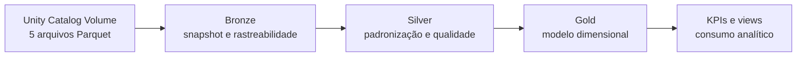

# Nordeste Health Lakehouse

Pipeline lakehouse em Databricks para integrar e qualificar dados cadastrais de saúde do Nordeste brasileiro. O projeto transforma cinco snapshots Parquet relacionados ao CNES/DataSUS em tabelas Delta nas camadas Bronze, Silver e Gold, aplica controles de qualidade e publica indicadores sobre capacidade hospitalar, infraestrutura e força de trabalho.

> **Escopo de uso:** os resultados descrevem registros cadastrais e cenários analíticos. Eles não medem desfechos clínicos, não comprovam disponibilidade física em tempo real e não certificam conformidade normativa ou segurança assistencial.

## Visão geral

O pipeline processa cinco domínios:

- estabelecimentos de saúde;
- habilitações;
- leitos;
- profissionais;
- equipamentos.

O fluxo foi desenhado como uma carga batch de snapshot mensal. A configuração atual usa a competência `202607`, o catálogo `nordeste-health-lakehouse`, o recorte das nove UFs do Nordeste e a versão de referências `2026-09-29_v1`.

As saídas analíticas principais são:

1. **Suporte intensivo:** horas hospitalares semanais cadastradas de médicos intensivistas e enfermeiros por leito de UTI selecionado. A regra é implementada em PySpark e Spark SQL, com teste de equivalência integral.
2. **Densidade tecnológica:** inventário de equipamentos por modalidade de UTI e comparação com um cenário explícito de uma unidade cadastrada por leito. O déficit calculado é uma hipótese do projeto, não uma exigência normativa.
3. **Concentração de ocupações médicas:** distribuição municipal de ocupações médicas diferenciadas e de suas horas cadastradas. O CBO informa ocupação e não comprova titulação de especialidade.

## Arquitetura



### Stack

| Componente | Uso no projeto |
| --- | --- |
| Databricks | Execução dos notebooks e orquestração do job |
| Apache Spark / PySpark | Leitura, transformação, validação e agregação distribuída |
| Spark SQL | DDL, views e implementação independente de regras analíticas |
| Delta Lake | Tabelas ACID, histórico, `replaceWhere`, `OPTIMIZE` e `ZORDER` |
| Unity Catalog | Catálogo, schemas, volume, tabelas, views e concessões de acesso |
| Declarative Automation Bundles | Definição versionada do job e das dependências entre tarefas |
| GitHub | Versionamento, revisão e rastreabilidade do código |

### Fluxo por camada

| Camada | Responsabilidade | Objetos principais |
| --- | --- | --- |
| Landing | Receber os cinco arquivos Parquet com nomes controlados | Volume `landing.files` |
| Bronze | Preservar schema e conteúdo de origem; adicionar arquivo e horário de carga | Cinco tabelas de origem e auditorias de conteúdo/reprocessamento |
| Silver | Normalizar nomes e tipos, filtrar Nordeste e competência, validar chaves, separar rejeições e perfilar órfãos | Cinco tabelas tratadas, tabelas de rejeição/conflito e `contrato_medidas` |
| Gold | Aplicar chaves substitutas, pseudonimizar identificadores, criar dimensões, fatos, ponte e referências versionadas | Quatro dimensões, duas fatos, ponte de habilitações e histórico mensal |
| Analytics | Executar testes de negócio, calcular KPIs, validar equivalência e publicar views | Três KPIs, quatro views de consumo e evidências de testes |

## Estrutura do repositório

```text
.
├── databricks.yml
├── resources/
│   └── nordeste_health_pipeline.job.yml
├── src/
│   ├── notebooks/
│   │   ├── 01_bronze_ingestion.py
│   │   ├── 02_silver_transformation.py
│   │   ├── 03_gold_model.py
│   │   └── 04_analytics_validation.py
│   └── setup/
│       └── 00_bootstrap.sql
├── .gitignore
└── README.md
```

Os notebooks foram extraídos do arquivo DBC para o formato Databricks source. Esse formato mantém as células e os comandos mágicos, permite revisão linha a linha no Git e evita versionar resultados de execução e metadados internos presentes no contêiner DBC. Uma célula exatamente duplicada no notebook analítico foi removida durante a conversão; a lógica e as saídas permanecem equivalentes.

## Pré-requisitos

- workspace Databricks com Unity Catalog habilitado;
- compute compatível com Unity Catalog, Volumes e Delta Lake;
- Databricks CLI autenticada para usar o bundle, ou acesso à interface para execução manual;
- permissão para criar ou usar o catálogo `nordeste-health-lakehouse`;
- permissões de criação e modificação nos schemas `landing`, `bronze`, `silver` e `gold`;
- cinco arquivos Parquet com os nomes e colunas esperados.

O principal que executa o pipeline precisa, conforme os objetos já existentes no ambiente, de `USE CATALOG`, `USE SCHEMA`, `SELECT`, `MODIFY`, `CREATE TABLE` e `CREATE VOLUME`. `CREATE CATALOG` só é necessário no bootstrap quando o catálogo ainda não existe.

## Arquivos de entrada

Envie os arquivos abaixo para:

```text
/Volumes/nordeste-health-lakehouse/landing/files
```

| Arquivo | Colunas usadas pelo pipeline |
| --- | --- |
| `estabelecimentos_de_saude.parquet` | `CO_CNES`, `CO_UF`, `CO_IBGE`, `NO_FANTASIA`, `CO_UNIDADE` |
| `habilitacoes.parquet` | `CNES`, `SGRUPHAB`, `COMPETEN` |
| `leitos.parquet` | `CNES`, `CODLEITO`, `QT_EXIST`, `COMPETEN`, `TP_LEITO` |
| `profissionais.parquet` | `CNES`, `CNS_PROF`, `CBO`, `VINCULAC`, `COMPETEN`, `HORAHOSP`, `HORA_AMB`, `HORAOUTR`, `PROF_SUS` |
| `equipamentos.parquet` | `CNES`, `CODEQUIP`, `QT_USO`, `COMPETEN`, `TIPEQUIP` |

Os nomes são validados antes da ingestão. Mudanças no schema da fonte exigem revisão explícita do mapeamento em `02_silver_transformation.py`.

## Configuração

### 1. Criar catálogo, schemas e volume

Execute `src/setup/00_bootstrap.sql` em um SQL editor ou como notebook Databricks. A operação é idempotente por usar `IF NOT EXISTS`.

### 2. Carregar os arquivos

Depois do bootstrap, envie os cinco Parquet ao volume `landing.files`. Não armazene dados brutos no Git: `.dbc`, `.parquet` e o diretório `data/` estão ignorados.

### 3. Conferir o snapshot

Antes de cada nova competência, revise estes parâmetros:

| Parâmetro | Arquivo | Valor atual |
| --- | --- | --- |
| `CATALOGO` | quatro notebooks | `nordeste-health-lakehouse` |
| `COMPETENCIA` | Silver | `202607` |
| `EVIDENCIA_TEMPORAL` | Silver | referência da extração e confirmação da competência |
| `UFS_ESCOPO` | Silver | nove UFs do Nordeste |
| `VERSAO_REFERENCIAS` | Gold e Analytics | `2026-09-29_v1` |
| Regras e metas analíticas | Analytics | cenário `cenario_uti_v1`; metas de horas sem referência quantitativa |

A evidência temporal deve apontar para o artefato real da extração. Uma página institucional genérica, isoladamente, não comprova a competência do snapshot.

## Como executar

### Opção A — Bundle declarativo

Clone o repositório e autentique a CLI:

```bash
git clone https://github.com/RowerBomfim/nordeste-health-lakehouse.git
cd nordeste-health-lakehouse
databricks auth login --host https://<seu-workspace-databricks>
```

Informe o ID de um cluster existente, valide e publique o job:

```bash
export BUNDLE_VAR_cluster_id="<cluster-id>"
databricks bundle validate -t dev
databricks bundle deploy -t dev
databricks bundle run -t dev nordeste_health_pipeline
```

O job limita a concorrência a uma execução e encadeia as tarefas nesta ordem:

```text
bronze -> silver -> gold -> analytics_validation
```

### Opção B — Execução manual

Importe ou sincronize a pasta `src/notebooks` no workspace e execute, na mesma ordem:

1. `01_bronze_ingestion.py`
2. `02_silver_transformation.py`
3. `03_gold_model.py`
4. `04_analytics_validation.py`

Interrompa o fluxo quando uma asserção falhar. As validações foram projetadas para impedir a publicação silenciosa de um snapshot inconsistente.

## Controles de qualidade e observabilidade

O pipeline inclui controles em diferentes pontos do fluxo:

- conferência da presença dos cinco arquivos e inspeção de schema;
- preservação de tipos e reconciliação de contagens na Bronze;
- comparação de conteúdo e teste de reprocessamento com Delta Time Travel;
- normalização de colunas e códigos, inclusive zeros à esquerda;
- validação de formato, nulidade, intervalo e competência;
- deduplicação apenas de registros com conteúdo idêntico;
- falha explícita para conflitos de chave de negócio;
- segregação de rejeitados, outros meses, registros fora do recorte e órfãos;
- auditoria da taxa e do impacto quantitativo de órfãos;
- reconciliação de leitos, equipamentos e horas entre Silver e Gold;
- testes de PK, FK e cardinalidade;
- testes de negócio com respostas conhecidas;
- equivalência integral entre as versões PySpark e SQL do KPI 1;
- validação de limites numéricos e estados analíticos dos KPIs;
- histórico Delta, estatísticas e comparação de desempenho antes/depois de `ZORDER`.

## Principais decisões técnicas

### Snapshot batch com reprocessamento controlado

A Bronze representa a fotografia recebida e usa `overwrite`. Silver e Gold também materializam o estado corrente, enquanto tabelas `historico_*` preservam snapshots Gold por competência e recorte. `MERGE` ou CDC só devem ser adotados quando a fonte fornecer alterações identificáveis ou versões por chave.

### Qualidade antes de deduplicação agressiva

A deduplicação usa a impressão digital do conteúdo completo. Quando duas linhas diferentes compartilham a mesma chave de negócio, o pipeline grava o conflito e falha. Essa escolha evita ocultar registros legítimos por uma regra arbitrária de “última linha vence”.

### Modelo dimensional sem multiplicação de medidas

Leitos e equipamentos são agregados antes dos joins e reunidos em uma fato de capacidade com tipos de recurso explícitos. Profissionais ficam em uma fato separada. A ponte de habilitações evita multiplicar quantidades ao combinar relacionamentos de granularidades diferentes.

### Chaves determinísticas e proteção de identificadores

As chaves substitutas são hashes SHA-256 de chaves de negócio normalizadas. O CNS não é publicado na dimensão Gold; um identificador analítico determinístico é derivado por hash. Isso é pseudonimização, não anonimização. A Silver ainda contém o identificador de origem e deve ter acesso restrito.

### Referências e hipóteses versionadas

Classificações de CBO, leitos, equipamentos e habilitações carregam versão e fonte. Uma versão existente não pode mudar silenciosamente. Cenários analíticos são rotulados separadamente de regras normativas e as saídas propagam alertas de cobertura e limitações de interpretação.

### Camada de consumo por views

Consumidores devem receber `SELECT` nas views Gold, e não acesso amplo às tabelas intermediárias. O notebook analítico contém um bloco opcional de grants que só executa quando `GRUPO_CONSUMO` é preenchido com um grupo real do ambiente.

## Objetos de consumo

| View | Conteúdo |
| --- | --- |
| `gold.vw_capacidade_hospitalar` | Capacidade cadastrada por estabelecimento e tipo de recurso |
| `gold.vw_suporte_intensivo` | Proporcionalidade de horas hospitalares e leitos UTI |
| `gold.vw_densidade_tecnologica` | Inventário e déficit no cenário por equipamento/habilitação |
| `gold.vw_concentracao_especialistas` | Concentração municipal de ocupações médicas diferenciadas |

## Segurança e governança

- dados brutos e arquivos DBC não são versionados;
- resultados de células foram removidos da exportação publicada;
- identificadores profissionais diretos ficam restritos às camadas internas;
- o acesso analítico deve ocorrer por views Gold com menor privilégio;
- fontes de referência, versões de classificação e evidência temporal ficam registradas junto às regras;
- logs e tabelas de rejeição devem seguir a política de retenção e acesso do workspace.

## Limitações conhecidas

- a configuração de catálogo, competência e referências ainda está declarada nos notebooks; uma evolução natural é centralizá-la em parâmetros de job;
- o snapshot de estabelecimentos não possui competência na origem e depende de evidência externa de compatibilidade temporal;
- `HORAHOSP` representa carga hospitalar cadastrada por vínculo e não dedicação exclusiva à UTI;
- inventário cadastral não demonstra disponibilidade operacional do equipamento;
- CBO indica ocupação e não comprova título de especialista;
- o projeto não inclui os arquivos de dados, contagens finais ou credenciais do workspace.

## Validação local do código-fonte

É possível verificar a sintaxe Python sem executar Spark:

```bash
python -m py_compile src/notebooks/*.py
```

A validação funcional completa exige Databricks, Unity Catalog e os cinco arquivos Parquet do snapshot.
